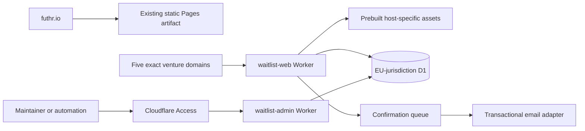

# Multi-brand waitlist platform

Status: recommended architecture, not yet implemented or deployed  
Date: 4 September 2026

## Decision

Keep `futhr.io` as the existing prerendered Cloudflare Pages site. Build the
waitlists as a separate application, deployment, and verified artifact. Attach
only these exact Custom Domains to the public waitlist Worker:

- `rivure.com`
- `diggymon.com`
- `refpath.io`
- `reloved.eco`
- `orvane.io`

WoTEx is not on this list: it is fully open source and has no waiting list, so
`wotex.io` points at its public repositories and documentation instead.

Each venture domain serves its landing page at `/`. There should be no public
`/waiting-list` route on `futhr.io`, and the waitlist build must not be copied
into the main `build/` directory. Unknown hosts receive `404`; they never fall
back to either the Futhr page or a default venture.

Cloudflare Custom Domains are a good fit because they make the Worker the origin
for every path on an exact hostname, support several domains on one Worker, and
do not use wildcard matching. Apex and `www` are separate hostnames, so any
desired `www` behaviour must be configured explicitly. [Cloudflare Custom
Domains](https://developers.cloudflare.com/workers/configuration/routing/custom-domains/)



This is hostname exposure isolation, not a claim that a person visiting
`futhr.io` cannot manually browse to `rivure.com`. The enforceable contract is
that `futhr.io` never serves or accepts the waitlist, while a venture domain
never serves the Futhr showcase.

## Deployable boundaries

| Deployable | Public address | Capability | Artifact |
| --- | --- | --- | --- |
| Futhr showcase | `futhr.io` | Read-only editorial site | `build/` |
| Component workshop | `ui.futhr.io` | Storybook, independently deployed | `storybook-static/` |
| Venture waitlists | Five venture domains | Branded pages, subscribe, confirm, unsubscribe | `apps/waitlist/dist/` |
| List administration | `lists.futhr.io` | Authenticated list API | Worker code only |

Use `workers_dev = false` and `preview_urls = false` for both production
waitlist Workers. This removes accidental public `workers.dev` and versioned
preview entry points. Cloudflare documents that preview URLs otherwise follow
the `workers_dev` setting by default. [Workers preview
URLs](https://developers.cloudflare.com/workers/versions-and-deployments/preview-urls/)

The public and admin Workers should be separate. The public Worker can create,
confirm, and withdraw subscriptions but has no read or export route. The admin
Worker can read and delete records but is reachable only through Cloudflare
Access. This is a more useful boundary than hiding an admin path inside the same
public application.

## Application layout

Use a pnpm workspace package rather than adding dynamic routes to the existing
static SvelteKit application:

```text
apps/waitlist/
├── src/
│   ├── brands/
│   │   ├── brands.ts
│   │   └── copy/
│   ├── components/
│   │   ├── landing.svelte
│   │   └── signup.svelte
│   ├── server/
│   │   ├── crypto.ts
│   │   ├── subscriptions.ts
│   │   └── turnstile.ts
│   ├── worker.ts
│   └── admin-worker.ts
├── migrations/
├── static/
└── wrangler.toml
```

One generic Svelte 5 page should be prerendered five times from a closed, typed
brand configuration. Use the existing reusable mark components as the vector
source, with build-generated SVG/PNG files for metadata that cannot consume a
Svelte component. The current mapping is:

| Host | Brand | Mark source |
| --- | --- | --- |
| `rivure.com` | Rivure | `src/lib/components/logos/rivure.svelte` |
| `diggymon.com` | Diggymon | `src/lib/components/logos/diggymon.svelte` |
| `refpath.io` | Refpath | `src/lib/components/logos/refpath.svelte` |
| `reloved.eco` | Reloved | `src/lib/components/logos/reloved.svelte` |
| `orvane.io` | Orvane | `src/lib/components/logos/orvane.svelte` |

The configuration owns the host, stable brand ID, locale, unique page copy,
theme tokens, mark component, icon source, metadata, privacy wording, consent
version, Turnstile site key, and sender identity. The browser never supplies a
trusted `brand_id`; the Worker derives it from the request hostname.

The Worker runs before static assets, checks the hostname against that map, and
rewrites safe public paths to an internal `/brands/<brand>/...` asset path before
calling `ASSETS.fetch`. Cloudflare provides one asset collection per Worker and
supports this Worker-first asset-binding pattern. [Static Assets
bindings](https://developers.cloudflare.com/workers/static-assets/binding/)

Prerender the visible HTML and critical CSS. Hydrate only the form state and
Turnstile integration. The initial brand, logo, copy, and metadata must not wait
for client JavaScript. No UI library is necessary; use the repository's Tailwind
v4 token approach and strict Biome rules.

## Public request contract

Allow only these public routes on a venture host:

| Route | Methods | Behaviour |
| --- | --- | --- |
| `/` | `GET`, `HEAD` | Branded landing page |
| `/privacy` | `GET`, `HEAD` | Brand-specific collection notice |
| `/manifest.webmanifest` | `GET`, `HEAD` | Brand manifest |
| `/robots.txt`, `/sitemap.xml`, `/llms.txt` | `GET`, `HEAD` | Generated brand files |
| `/assets/*`, `/icons/*` | `GET`, `HEAD` | Versioned public assets |
| `/api/v1/subscriptions` | `POST` | Create or resend a pending subscription |
| `/confirm` | `GET`, `POST` | Show confirmation, then consume token |
| `/unsubscribe` | `GET`, `POST` | Show withdrawal, then consume token |

Reject unexpected methods with `405`, unsupported content types with `415`,
oversized input with `413`, rate-limited requests with `429`, and unknown paths
with `404`. Do not enable CORS because the form is same-origin. Validate the
request `Origin` where present and compare it to the closed host map.

The subscribe endpoint accepts only an email address and Turnstile token. It
must return the same accepted response whether the address is new, already
pending, confirmed, or withdrawn, so callers cannot enumerate the list. OWASP
recommends consistent responses, rate limiting, content-type/input validation,
and random, single-use, expiring verification tokens. [OWASP email
verification](https://cheatsheetseries.owasp.org/cheatsheets/Email_Validation_and_Verification_Cheat_Sheet.html)
and [REST security](https://cheatsheetseries.owasp.org/cheatsheets/REST_Security_Cheat_Sheet.html)

## Submission and confirmation flow

1. Resolve the brand from the exact effective hostname and reject any unknown
   host before reading the form.
2. Enforce method, content type, a small body-size limit, email length, and a
   conservative syntax check. Preserve the submitted mailbox value while using
   a documented canonical form for comparison.
3. Apply an outer WAF rate-limit rule and an application-aware Worker rate-limit
   binding. The Worker counters are intentionally permissive and eventually
   consistent, so they are a layer rather than an accounting mechanism.
   [Workers Rate Limiting](https://developers.cloudflare.com/workers/runtime-apis/bindings/rate-limit/)
4. Validate Turnstile through Siteverify. Check `success`, expected `hostname`,
   and a brand-specific `action`. Tokens are single-use and expire after five
   minutes, and client-only validation is not protection. [Turnstile server-side
   validation](https://developers.cloudflare.com/turnstile/get-started/server-side-validation/)
5. Generate a cryptographically random confirmation token, store only its hash,
   and give it a short expiry. The confirmation URL must come from the trusted
   brand configuration, never the request `Host` header.
6. Insert or update the pending record synchronously using a prepared statement
   and database uniqueness. Only then enqueue the confirmation message.
7. Queue consumers use the subscription ID as an idempotency key. Cloudflare
   Queues is at-least-once delivery, so duplicate delivery is expected and a
   dead-letter queue is required. [Queue delivery
   guarantees](https://developers.cloudflare.com/queues/reference/delivery-guarantees/)
8. A confirmation link first renders a page. A deliberate `POST` consumes the
   token and changes status, avoiding confirmation by an email security scanner
   that merely follows links.

Use one production Turnstile widget per brand, restricted to that hostname, and
separate development widgets. This gives clean revocation and abuse telemetry
per venture. The CSP must permit the documented Turnstile script and frame
origins. [Turnstile CSP](https://developers.cloudflare.com/turnstile/reference/content-security-policy/)

## Data model and protection

D1 is proportionate for a small relational list and supports an EU jurisdiction
at database creation. Use `--jurisdiction=eu`; a Western Europe location hint is
not a residency control, and jurisdiction cannot be added later. Workers can
still execute outside that region, so the setting is not a claim that every
processing operation stays in the EU. [D1 data
location](https://developers.cloudflare.com/d1/configuration/data-location/)

A minimal record needs:

```text
id
brand_id
email_ciphertext
email_iv
email_digest
encryption_key_version
status                  pending | confirmed | withdrawn
consent_version
requested_at
confirmed_at
withdrawn_at
confirmation_digest
confirmation_expires_at
created_at
updated_at
```

Add a unique database constraint on `(brand_id, email_digest)`. Bind every value
through D1 prepared statements; Cloudflare explicitly recommends `bind()` to
prevent SQL injection. [D1 prepared
statements](https://developers.cloudflare.com/d1/worker-api/prepared-statements/)

D1 already encrypts stored objects with AES-256-GCM and Worker/database traffic
with TLS. Add application-level AES-256-GCM for the email value so a database
export does not reveal addresses by itself. Use an independent keyed HMAC digest
for duplicate lookup, not a plain email hash that can be dictionary-tested.
Store the encryption and HMAC keys as versioned Worker secrets, separately from
D1, and implement rotation before launch. [D1 data
security](https://developers.cloudflare.com/d1/reference/data-security/) and
[OWASP cryptographic storage](https://cheatsheetseries.owasp.org/cheatsheets/Cryptographic_Storage_Cheat_Sheet.html)

Do not retain full IP addresses, full user agents, or referrers by default.
Short-lived anti-abuse data is permissible only after documenting why it is
necessary and when it is purged. Application logs must never contain plaintext
emails, confirmation tokens, Access secrets, or complete authorization headers.

Use committed sequential D1 migrations, staging before production, and recovery
tests. D1 Time Travel is useful short-horizon recovery, not a permanent archive.
If long-term backups are genuinely required, encrypt exports and use an
EU-jurisdiction R2 bucket with an explicit retention schedule.

## Consent and privacy design

An email address is personal data. The collection screen must identify the
controller, state the exact purpose and legal basis, link to a layered privacy
notice, explain retention, recipients/transfers, withdrawal and data-subject
rights, and give an IMY complaint route. GDPR also requires purpose limitation,
data minimisation, storage limitation, appropriate security, and demonstrable
consent. [GDPR](https://eur-lex.europa.eu/eli/reg/2016/679/oj) and [EDPB consent
guidance](https://www.edpb.europa.eu/system/files/documents/files/file1/edpb_guidelines_202005_consent_en.pdf)

A suitable narrow treatment is:

> Join the Rivure waiting list. We will use your email only to confirm your
> signup and send Rivure launch updates. Unsubscribe at any time. Privacy.

The labelled submit action is the affirmative action for that one disclosed
purpose. Do not add product newsletters, cross-venture promotion, profiling, or
analytics to that consent later. Ask separately if the purpose expands.

Use double opt-in. It reduces typo and third-party signups and creates strong
evidence, but neither the reviewed GDPR nor Swedish provision mandates that
specific mechanism. The pre-confirmation message should contain only the
confirmation request, not promotion.

Swedish law generally requires prior consent for promotional email to a natural
person when the narrow existing-customer exception does not apply, and each
marketing email needs a valid stop address. [Swedish Marketing Act sections 19
and 20](https://www.riksdagen.se/sv/dokument-och-lagar/dokument/svensk-forfattningssamling/marknadsforingslag-2008486_sfs-2008-486/)

Set retention in configuration and policy before launch. A defensible starting
point is to expire unconfirmed records after 30 days and review confirmed records
at 12 months, but the controller must tie the final periods to the actual launch
plan. Withdrawn addresses should be erased or reduced to the minimum suppression
proof needed under a separately documented purpose and period. IMY treats an
objection to direct marketing as absolute. [IMY right to
object](https://www.imy.se/privatperson/dataskydd/dina-rattigheter/att-gora-invandningar/)

Before production, identify the legal controller for every brand, accept the
applicable processor terms, and review subprocessors and international transfers.
Publish a notice on every venture host without changing the current Futhr notice
to imply that `futhr.io` collects the list. Cloudflare's DPA identifies the
customer as controller and Cloudflare as processor where applicable. [Cloudflare
DPA](https://www.cloudflare.com/cloudflare-customer-dpa/)

## Administrative API

Use `lists.futhr.io` for the private API because it is short and accurately
describes the resource. Protect the whole hostname with Cloudflare Access. Human
access requires an individual identity and MFA. Each automation gets its own
rotatable Access service token and least-privilege policy.

The admin Worker must validate the `Cf-Access-Jwt-Assertion` signature, issuer,
and application audience rather than trusting header presence. [Access service
tokens](https://developers.cloudflare.com/cloudflare-one/access-controls/service-credentials/service-tokens/)
and [JWT validation](https://developers.cloudflare.com/cloudflare-one/access-controls/applications/http-apps/authorization-cookie/validating-json/)

Recommended versioned endpoints:

```text
GET    /v1/brands
GET    /v1/brands/:brand/subscriptions?status=confirmed&cursor=...
GET    /v1/brands/:brand/subscriptions/:id
DELETE /v1/brands/:brand/subscriptions/:id
POST   /v1/brands/:brand/exports
GET    /v1/exports/:id
```

Authorize the requested brand on every operation. Exports should be asynchronous,
short-lived, audited, encrypted, and unavailable by default to ordinary API
clients. Never expose Cloudflare account or D1 REST credentials to a browser.

## Metadata, PWA, and localisation

Generate all of these from the same compile-time brand record:

- unique visible title, introduction, and page description
- `<title>`, meta description, self-referential canonical, Open Graph, and social image
- brand favicon, Apple touch icon, 192 px, 512 px, and maskable icons
- `manifest.webmanifest` with per-origin `name`, `short_name`, `description`,
  `id: "/"`, `start_url: "/"`, `scope: "/"`, and theme colours
- minimal `robots.txt`, one-URL sitemap, and per-brand `llms.txt`

The manifest values do not need runtime localisation or SSR. Each host receives
its prebuilt version after server-side host selection. Manifest identity,
navigation scope, and service-worker control are origin-bound by browser
standards. [Web App Manifest](https://www.w3.org/TR/appmanifest/)

Do not cross-canonical the ventures to Futhr. Give each page meaningful visible
copy rather than changing only its logo and metadata; Google can cluster
substantially duplicated pages. [Google canonicalisation
guidance](https://developers.google.com/search/docs/crawling-indexing/canonicalization)

`llms.txt` is generated exactly like the manifest. It should identify the brand
as pre-launch, link only to that domain and its privacy/contact address, and make
no product-availability claim. It does not become dynamic or shared with the
Futhr file.

Start without a service worker. A manifest and install icons satisfy the requested
brand metadata while a one-field landing page gains almost nothing from offline
caching. This also avoids persistent-cache lifecycle and a currently uncertain
application of Sweden's terminal-storage rule to automatic service-worker
storage. If an offline requirement appears later, register `/sw.js` per origin,
cache only immutable public assets, and never cache form submissions,
confirmation URLs, privacy pages, or API/admin responses.

Keep English copy in the typed brand configuration and adjacent Markdown where
longer legal content benefits from authoring. Do not add a runtime localisation
library for one language. When a second locale is real, add a compiler-based
message catalogue and locale-specific content in one change, then generate
`hreflang`, manifest language, and locale routes together.

## Email delivery

Hide delivery behind a small TypeScript interface so provider choice does not
leak into the subscription domain model. Cloudflare Email Service is attractive
because it has a Worker binding and supports transactional messages after sender
domain onboarding, but the sending product is currently Beta and arbitrary
recipients require Workers Paid. [Cloudflare Email
Service](https://developers.cloudflare.com/email-service/)

Evaluate it against a mature transactional provider using deliverability,
EU-transfer terms, bounce/complaint webhooks, suppression handling, operational
visibility, and exit cost. The queue payload should contain a subscription ID
and template/version data, not a reusable mail-provider credential or unnecessary
personal data.

## Security headers and caching

Apply headers in Worker-generated responses because `_headers` rules do not apply
to responses created by Worker code. At minimum:

- a nonce-based CSP that admits only required self assets and Turnstile
- `frame-ancestors 'none'`
- `Referrer-Policy: no-referrer`
- `X-Content-Type-Options: nosniff`
- a restrictive `Permissions-Policy`
- no-store responses for form, token, and API routes
- long immutable caching only for content-hashed assets

Do not place the email or confirmation token in analytics, query-preserving
redirects, referrers, or error output.

## Verification and release gates

Add a CI matrix that builds and tests the three artifacts independently. Extend
the existing artifact verifier so:

- `build/` rejects waitlist routes, brand manifests, D1/Turnstile/admin code, and Storybook
- `storybook-static/` rejects production manifests, service workers, and waitlist code
- `apps/waitlist/dist/` rejects the Futhr index and Storybook markers

Required tests before any domain is attached:

- unit tests for hostname mapping, unknown-host rejection, validation, crypto,
  token expiry/single use, consent versions, and status transitions
- D1 migration/integration tests for uniqueness, tenant filtering, deletion, and
  concurrent duplicate submissions
- Worker tests with production-like bindings for Turnstile success/failure,
  rate limiting, generic responses, queue retry/idempotency, and Access JWT validation
- Playwright tests for all five hosts, unique metadata/manifests/icons, no-JavaScript
  first paint, keyboard/screen-reader form use, reduced motion, confirmation,
  unsubscribe, offline/non-cache behaviour, and cross-brand isolation
- negative deployment tests proving `futhr.io/waiting-list` and the Futhr-hosted
  submission endpoint are `404`, and every venture host fails closed on unknown paths
- restore, key-rotation, deletion, export-expiry, and incident-response exercises

Deploy staging with separate D1, queues, Turnstile widgets, secrets, Access
credentials, and hostnames. Never bind staging to production data. Attach the five
production Custom Domains only after the route-isolation and privacy checks pass.

## Rejected alternatives

| Alternative | Why it is weaker here |
| --- | --- |
| Add `/waiting-list` to the Futhr SvelteKit app | Violates the requested host and artifact boundary and makes accidental Futhr exposure easy |
| Select the brand only in browser JavaScript | Wrong first paint and crawler metadata, spoofable brand input, and visible fallback flashes |
| Five copied applications | Strong isolation but needless drift across identical security, form, and legal behaviour |
| One public Worker with hidden admin routes | Larger public capability surface and weaker operational separation |
| Store plaintext email because D1 is encrypted | Database exports and authorised database access still reveal the list |
| Use email as a queue-only event before storage | At-least-once delivery is not the authoritative record and complicates acceptance semantics |
| Ship offline service-worker caching immediately | No material landing-page benefit and additional privacy/cache invalidation work |
| Add runtime i18n now | More client/runtime surface without a second language requirement |

## Decisions still required before implementation

These are product or account choices, not gaps the code should guess:

1. The legal controller name and contact details for all five brands.
2. Final unique landing copy, theme tokens, social images, and launch-update scope.
3. Exact retention periods and whether any suppression proof remains after withdrawal.
4. Transactional email provider after DPA, transfer, deliverability, and beta-risk review.
5. Whether each apex should also accept or redirect its `www` hostname.
6. Who receives human admin access and which automations need brand-scoped API tokens.
7. Whether a service worker has a genuine product requirement later.

This document is an engineering and privacy-by-design recommendation, not a legal
opinion. Final collection text, controller disclosures, vendor contracts, and
retention policy should receive qualified review before production.
